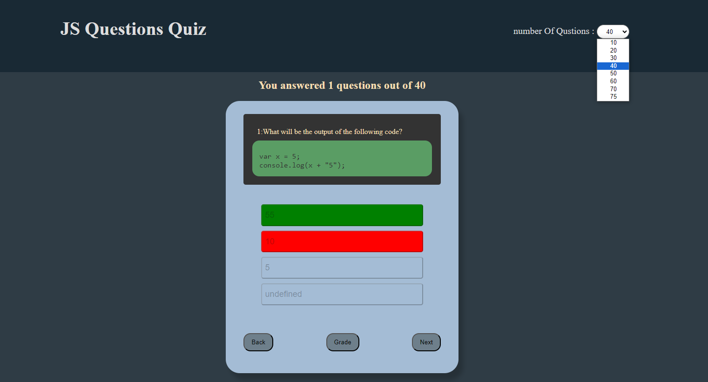

# JavaScript Questions Quiz

Welcome to the JavaScript Questions Quiz! This interactive quiz tests your JavaScript knowledge with a series of questions. Try your best to answer correctly and see how you score!

## Features

- Choose the number of questions you want to answer.
- Read the question and code snippet provided.
- Select an answer from the options.
- See immediate feedback on your answer.
- View your current score.
- Highlight of the correct answer if you select the wrong one.
- Show your grade at the end of the quiz.

## Demo

Check out the live demo of the quiz: [Live Demo]([https://yahyamohmuedpro99.github.io/JSQuizApp/])

## How to Use

1. Clone the repository to your local machine.
2. Open `index.html` in your web browser.
3. Choose the number of questions you want to answer.
4. Read each question and code snippet carefully.
5. Select an answer and see if you're correct!
6. Continue answering questions and watch your score grow.
7. Click the "Grade" button to see your final grade.

## Customization

You can customize the quiz by adding your own questions and code snippets. Just update the `qustions.js` file with your questions, options, and correct answers.

## Technologies Used

- HTML
- CSS
- JavaScript

## Contributing

Contributions are welcome! If you find any issues or have suggestions for improvements, feel free to submit a pull request.

## License

This project is licensed under the [MIT License](LICENSE).

---

**Disclaimer:** This quiz is intended for educational purposes and is not meant to be an exhaustive JavaScript assessment.

Have fun and happy quizzing! 🚀
